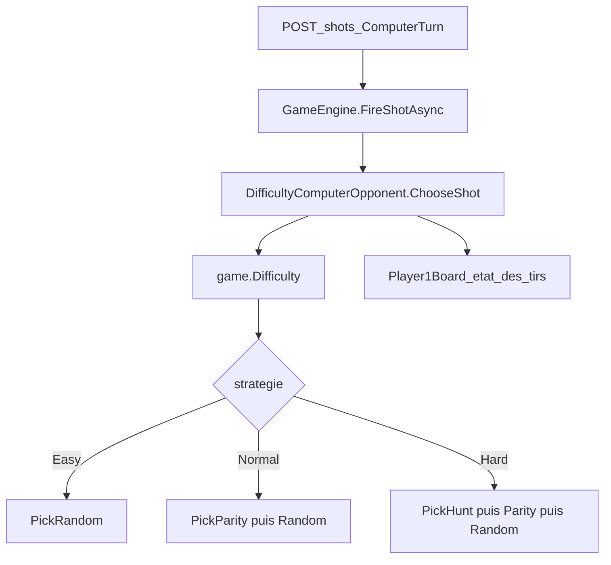

# Plan — difficulté ordinateur (option A, stateless)

## Objectif

Faire en sorte que `Difficulty` (déjà stockée sur `[Game](battleship/BattleShip.Models/Domain/Game.cs)` à la création PvE) modifie réellement le choix de tir de l'ordinateur via `[IComputerOpponent](battleship/BattleShip.Models/Services/IComputerOpponent.cs)`.

Aucun champ supplémentaire sur `Game`, aucun changement de contrat HTTP.




---

## Comportement par difficulté


| Niveau     | Algorithme      | Détail                                                                                       |
| ---------- | --------------- | -------------------------------------------------------------------------------------------- |
| **Easy**   | Aléatoire       | Case non tirée au hasard (comportement actuel)                                               |
| **Normal** | Parité (damier) | Parmi les cases non tirées, privilégier `(x + y) % 2 == 0` ; sinon random                    |
| **Hard**   | Chasse + parité | Si une case `Hit` existe (navire pas encore `Sunk`), tirer un voisin non tiré ; sinon Normal |


**Détection chasse (stateless)** : parcourir la grille joueur ; pour chaque cellule `CellState.Hit`, proposer les 4 voisins dans les bornes qui ne sont pas `IsAlreadyTargeted`. Pas besoin de `HuntQueue` : l'état est dérivé de `[Board.GetCell](battleship/BattleShip.Models/Domain/Board.cs)` / `[IsAlreadyTargeted](battleship/BattleShip.Models/Domain/Board.cs)`.

Note : après un `Sunk`, les cellules passent à `Sunk` (plus `Hit`), donc la chasse s'arrête naturellement.

---

## 1. Refactor du service adversaire (`IComputerOpponent`)

### Renommer et réécrire

- Renommer `[RandomComputerOpponent.cs](battleship/BattleShip.API/Services/RandomComputerOpponent.cs)` → `**DifficultyComputerOpponent.cs**`
- Mettre à jour l'enregistrement DI dans `[Program.cs](battleship/BattleShip.API/Program.cs)` :

```csharp
builder.Services.AddScoped<IComputerOpponent, DifficultyComputerOpponent>();
```

### Structure proposée

```csharp
public sealed class DifficultyComputerOpponent(Random random) : IComputerOpponent
{
    public (int X, int Y) ChooseShot(Game game)
    {
        var board = game.GetBoard(Participant.Player1);

        return game.Difficulty switch
        {
            Difficulty.Hard   => PickHuntTarget(board, random)
                                 ?? PickParityTarget(board, random)
                                 ?? PickRandomTarget(board, random),
            Difficulty.Normal => PickParityTarget(board, random)
                                 ?? PickRandomTarget(board, random),
            _                 => PickRandomTarget(board, random),
        };
    }
}
```

Méthodes privées statiques (testables via classe interne ou tests sur `ChooseShot` avec grilles construites) :


| Méthode                           | Rôle                                                               |
| --------------------------------- | ------------------------------------------------------------------ |
| `EnumerateUntargeted(board)`      | Liste `(x,y)` où `!IsAlreadyTargeted`                              |
| `PickRandomTarget(board, random)` | Extrait actuel de `RandomComputerOpponent`                         |
| `PickParityTarget(board, random)` | Filtre `(x+y)%2==0` parmi non tirées                               |
| `PickHuntTarget(board, random)`   | Voisins des `Hit`, hors cases déjà tirées ; random parmi candidats |


**Tir de l'ordinateur** : `GameEngine` appelle déjà `computerOpponent.ChooseShot(game)` sur `ComputerTurn` — **aucun changement** dans `[GameEngine.cs](battleship/BattleShip.API/Services/GameEngine.cs)`.

---

## 2. Mises à jour des références

Rechercher/remplacer `RandomComputerOpponent` → `DifficultyComputerOpponent` dans :

- `[BattleShip.Tests/Domain/GameEngineShotTests.cs](battleship/BattleShip.Tests/Domain/GameEngineShotTests.cs)`
- `[GameEngineFleetTests.cs](battleship/BattleShip.Tests/Domain/GameEngineFleetTests.cs)`
- `[GameEnginePvpTests.cs](battleship/BattleShip.Tests/Domain/GameEnginePvpTests.cs)`
- `[GameEnginePlacementTests.cs](battleship/BattleShip.Tests/Domain/GameEnginePlacementTests.cs)`

Conserver les `FixedComputerOpponent` de test (injectés manuellement) — inchangés.

---

## 3. Tests (`BattleShip.Tests`)

Créer `[Domain/DifficultyComputerOpponentTests.cs](battleship/BattleShip.Tests/Domain/DifficultyComputerOpponentTests.cs)` avec `Random(0)` fixe pour reproductibilité.

### Scénarios unitaires


| Test                       | Setup                                       | Assertion                                         |
| -------------------------- | ------------------------------------------- | ------------------------------------------------- |
| `Easy_PicksUntargetedCell` | Grille 5×5, quelques `Miss`                 | Tir pas déjà ciblé                                |
| `Normal_PrefersParity`     | Grille vide 4×4                             | `(x+y)%2==0`                                      |
| `Normal_FallsBackToRandom` | Toutes cases parité déjà tirées             | Tir sur case impaire restante                     |
| `Hard_PicksAdjacentToHit`  | Navire touché : `(2,2)=Hit`, voisins libres | Tir adjacent à `(2,2)`                            |
| `Hard_IgnoresSunkCells`    | Navire coulé (`Sunk`)                       | Pas de chasse autour ; retombe sur parité/random  |
| `NoAvailableCells_Throws`  | Grille entièrement tirée                    | `InvalidOperationException` (comportement actuel) |


Helper de test : construire un `Game` PvE minimal avec `Player1Board` pré-rempli (`PlaceShip`, `ResolveShot` manuels ou `GetCell` via placement + tirs).

### Test d'intégration optionnel (léger)

Dans `[FireShotEndpointTests.cs](battleship/BattleShip.Tests/Api/FireShotEndpointTests.cs)` ou test domaine : créer partie `difficulty: "Hard"`, simuler un `Hit` connu sur la grille joueur (si setup contrôlé), vérifier que le tir ordinateur suivant est adjacent — **seulement si le setup reste simple** ; sinon rester sur tests unitaires dédiés.

---

## 4. Documentation

- `[swagger.yaml](battleship/swagger.yaml)` : enrichir la description de `Difficulty` (Easy = random, Normal = damier, Hard = chasse)
- `[docs/adr/0003-contrat-api.md](battleship/docs/adr/0003-contrat-api.md)` ou nouvelle section ADR courte : comportement de l'ordinateur par difficulté
- `[CONTEXTE-IA.md](battleship/CONTEXTE-IA.md)` : passer P1 « Stratégie ordinateur » de Backlog → Fait

**Hors périmètre** : exposer `difficulty` dans `GameDto` (utile front mais non requis pour que la stratégie ordinateur fonctionne).

---

## 6. Vérification

```bash
./scripts/dotnet.sh test --filter "FullyQualifiedName~DifficultyComputerOpponent"
./scripts/dotnet.sh test
```

Manuel (`api.http`) :

1. `POST /games` avec `"difficulty": "Hard"`
2. Placer flotte → tirer jusqu'à un `Hit`
3. `POST /shots {}` (tour ordi) → observer case adjacente au touché

---

## Fichiers impactés (résumé)


| Fichier                               | Action                                                               |
| ------------------------------------- | -------------------------------------------------------------------- |
| `RandomComputerOpponent.cs`           | Renommer → `DifficultyComputerOpponent.cs`, implémenter 3 stratégies |
| `Program.cs`                          | MAJ DI                                                               |
| `DifficultyComputerOpponentTests.cs`  | Nouveau                                                              |
| Tests existants                       | Remplacer nom de classe                                              |
| `swagger.yaml`, ADR, `CONTEXTE-IA.md` | Doc comportement                                                     |


Pas de changement : `IComputerOpponent`, `Game`, `GameEngine`, endpoints.