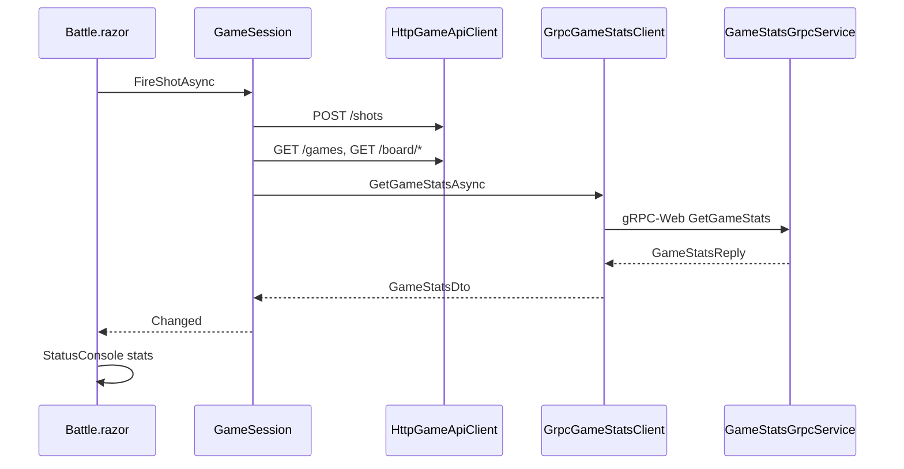

# Plan — front Blazor gRPC-Web `GameStats`

## Objectif

Le front appellera `GetGameStats` via `Grpc.Net.Client.Web` et affichera les compteurs dans l’UI de bataille.

**Hors périmètre** : stats en mode mock (`UseMockApi: true`) — pas d’affichage gRPC tant que le mock REST est actif (choix validé).




---

## 1. Contrat partagé (sans dépendance gRPC dans Models)

Ajouter un DTO REST-like dans `[BattleShip.Models/Contracts/GameStatsDto.cs](battleship/BattleShip.Models/Contracts/GameStatsDto.cs)` :

```csharp
public record GameStatsDto(
    Guid GameId,
    int PlayerShots,
    int ComputerShots,
    int PlayerHits,
    int ComputerHits,
    string Status);
```

Les composants Razor ne référencent **pas** les types protobuf générés (`BattleShip.Grpc.`* reste confiné à la couche client gRPC).

---

## 2. Packages et proto — `[BattleShip.App.csproj](battleship/BattleShip.App/BattleShip.App.csproj)`

```xml
<PackageReference Include="Grpc.Net.Client" Version="2.71.0" />
<PackageReference Include="Grpc.Net.Client.Web" Version="2.71.0" />
<PackageReference Include="Google.Protobuf" Version="3.31.1" />
<PackageReference Include="Grpc.Tools" Version="2.71.0" PrivateAssets="All" />

<Protobuf Include="..\Protos\battleship.proto" GrpcServices="Client" />
```

**Note build Docker / Apple Silicon** : si `protoc` segfault en `linux_arm64`, builder avec `DOCKER_DEFAULT_PLATFORM=linux/amd64` (même contournement que l’API). Le `[Dockerfile](battleship/BattleShip.App/Dockerfile)` copie déjà tout le repo (`COPY . .`) — le dossier `Protos/` sera disponible au publish.

---

## 3. Client gRPC — nouveaux fichiers dans `BattleShip.App/Services/`


| Fichier                                                                               | Rôle                                                                       |
| ------------------------------------------------------------------------------------- | -------------------------------------------------------------------------- |
| `[IGameStatsClient.cs](battleship/BattleShip.App/Services/IGameStatsClient.cs)`       | `Task<GameStatsDto?> GetGameStatsAsync(Guid gameId, CancellationToken ct)` |
| `[GrpcGameStatsClient.cs](battleship/BattleShip.App/Services/GrpcGameStatsClient.cs)` | Implémentation réelle                                                      |


Pattern cours (`[Referentiel.md` diapo 52](csharp-school/Ressources%20Bataille%20Navale/Referentiel.md)) :

```csharp
var channel = GrpcChannel.ForAddress(apiBaseUrl, new GrpcChannelOptions
{
    HttpHandler = new GrpcWebHandler(new HttpClientHandler())
});
var client = new GameStats.GameStatsClient(channel);
var reply = await client.GetGameStatsAsync(new GameStatsQuery { GameId = gameId.ToString() }, cancellationToken: ct);
```

Mapper `GameStatsReply` → `GameStatsDto`. Gérer `RpcException` : retourner `null` (ou propager une exception légère) — **ne pas bloquer** le flux de tir si les stats échouent.

### DI dans `[Program.cs](battleship/BattleShip.App/Program.cs)`

- Enregistrer `GrpcChannel` en **Singleton** (recommandé gRPC) avec `ApiBaseUrl` depuis config (déjà `http://localhost:8080/` dans `[wwwroot/appsettings.json](battleship/BattleShip.App/wwwroot/appsettings.json)`).
- Enregistrer `IGameStatsClient` → `GrpcGameStatsClient` en **Scoped** uniquement quand `UseMockApi` est `false` (même branche que `HttpGameApiClient`).
- Pas de `MockGameStatsClient`.

---

## 4. `GameSession` — orchestration

Modifier `[GameSession.cs](battleship/BattleShip.App/Services/GameSession.cs)` :

- Injecter `IGameStatsClient?` (nullable si mock, ou injecter seulement en mode réel via factory — préférer `IServiceProvider` ou enregistrement conditionnel + paramètre optionnel `IGameStatsClient? statsClient = null`).
- Nouvelle propriété publique : `GameStatsDto? Stats { get; private set; }`.
- Méthode privée `RefreshStatsAsync()` appelée après :
  - `LoadGameAsync` (rechargement page `/battle/{id}`)
  - `FireShotAsync` (après tir joueur + tir ordi PvE et refresh boards)
  - `PollLoopAsync` quand le statut PvP change (adversaire a joué)
- En cas d’échec gRPC : `Stats = null`, pas d’`AlertMessage` (le jeu REST continue) ; optionnel : log discret ou message HUD secondaire « Stats indisponibles ».

Point d’appel principal (après `[FireShotAsync](battleship/BattleShip.App/Services/GameSession.cs)` L162-L163) :

```csharp
Game = await client.GetGameAsync(Game.Id);
await RefreshBoardsAsync();
await RefreshStatsAsync();  // nouveau
```

---

## 5. UI — `[StatusConsole.razor](battleship/BattleShip.App/Shared/StatusConsole.razor)`

Étendre le panneau HUD existant :

- Conserver `Game.ShotCount` (REST) pour compatibilité.
- Si `Stats` non null, afficher en plus :
  - **Tirs joueur** → `Stats.PlayerShots`
  - **Tirs adversaire** → `Stats.ComputerShots`
  - **Touches joueur** → `Stats.PlayerHits`
  - **Touches adversaire** → `Stats.ComputerHits`
- Adapter `[StatusConsole.razor.css](battleship/BattleShip.App/Shared/StatusConsole.razor.css)` si besoin (`flex-wrap` gère déjà plusieurs items).

Modifier `[Battle.razor](battleship/BattleShip.App/Pages/Battle.razor)` L40 :

```razor
<StatusConsole Game="Session.Game" Stats="Session.Stats" />
```

---

## 6. Documentation


| Fichier                                                                                                           | Mise à jour                                                                                                                    |
| ----------------------------------------------------------------------------------------------------------------- | ------------------------------------------------------------------------------------------------------------------------------ |
| `[CONTEXTE-IA.md](battleship/CONTEXTE-IA.md)`                                                                     | P0 « échange gRPC-Web depuis le navigateur » → Fait ; préciser mock sans stats                                                 |
| `[README.md](battleship/README.md)`                                                                               | Section démo navigateur : `docker compose up`, jouer un tir, vérifier panneau stats + requête gRPC-Web dans DevTools (Network) |
| `[docs/plans/grpc_stats_gamestats_523d970d.plan.md](battleship/docs/plans/grpc_stats_gamestats_523d970d.plan.md)` | Marquer section 7 comme faite                                                                                                  |


Pas de changement API, proto, ni `GameEngine`.

---

## 7. Vérification

```bash
# Build front (amd64 si besoin sur Mac ARM)
docker compose up --build
# ou
DOCKER_DEFAULT_PLATFORM=linux/amd64 docker compose up --build

# Navigateur : http://localhost:8081
# 1. Créer partie PvE, placer flotte, tirer
# 2. Vérifier StatusConsole (tirs/touches des deux côtés)
# 3. DevTools → Network → filtre fetch/XHR → requête vers :8080 (gRPC-Web)
```

Tests automatisés front : **aucun** projet de tests Blazor existant — validation manuelle navigateur suffit pour cette passe (l’API gRPC reste couverte par les 8 tests `GameStats`* existants).

---

## Fichiers impactés (résumé)


| Fichier                                             | Action                  |
| --------------------------------------------------- | ----------------------- |
| `BattleShip.Models/Contracts/GameStatsDto.cs`       | Créer                   |
| `BattleShip.App/BattleShip.App.csproj`              | Packages + proto Client |
| `BattleShip.App/Services/IGameStatsClient.cs`       | Créer                   |
| `BattleShip.App/Services/GrpcGameStatsClient.cs`    | Créer                   |
| `BattleShip.App/Program.cs`                         | DI GrpcChannel + client |
| `BattleShip.App/Services/GameSession.cs`            | Stats + refresh         |
| `BattleShip.App/Shared/StatusConsole.razor` (+ css) | Affichage               |
| `BattleShip.App/Pages/Battle.razor`                 | Passer `Stats`          |
| `CONTEXTE-IA.md`, `README.md`                       | Doc                     |


