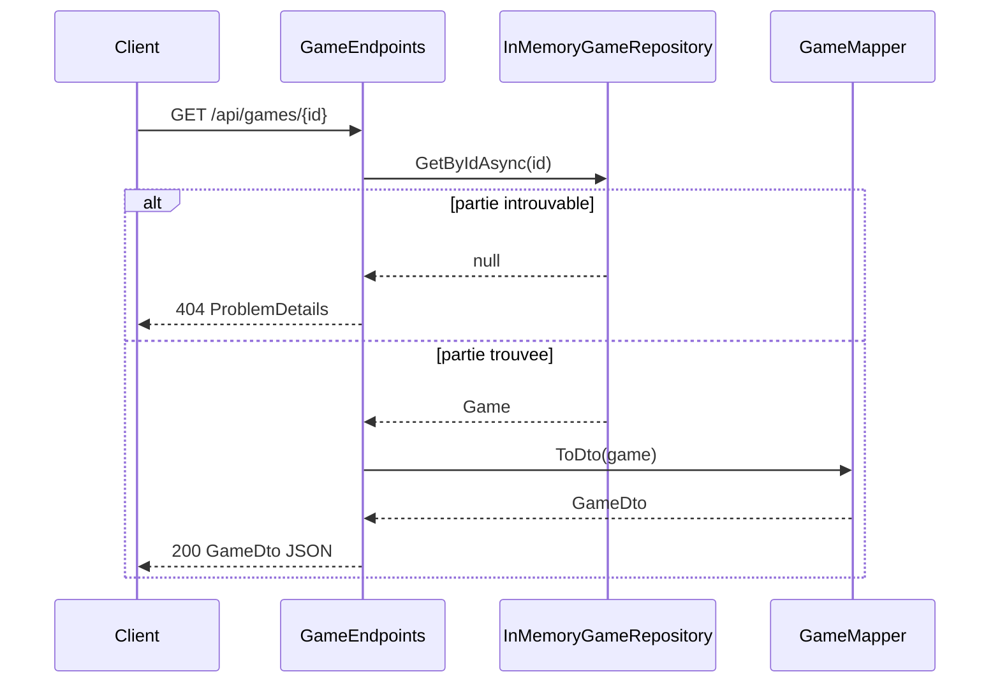

# Plan : GET /api/games/{id}

## Contexte

- **Contrat** : [`swagger.yaml`](battleship/swagger.yaml) lignes 60-76 — `GET /api/games/{id}`, paramètre `id` (UUID), réponse `200` + `GameDto` ou `404` ProblemDetails (`detail: "Partie inconnue"`).
- **État actuel** : `POST /api/games` implémenté ; [`IGameRepository.GetByIdAsync`](battleship/BattleShip.Models/Services/IGameRepository.cs) et [`GameMapper.ToDto`](battleship/BattleShip.API/Services/GameMapper.cs) déjà en place ; [`InMemoryGameRepository`](battleship/BattleShip.API/Services/InMemoryGameRepository.cs) opérationnel.
- **PROMPT-INIT** exige explicitement : `GET /api/games/{id}` → `200` + `GameDto` visible joueur, `404` si introuvable ; test d'intégration « 404 sur id inconnu » ([ligne 476](battleship/PROMPT-INIT.md)).

## Flux cible



## Périmètre

**Inclus** : une route GET, réutilisation `GameDto` / `GameMapper`, tests 200/404, `api.http`, MAJ ADR 0003 et README.

**Exclu** : grilles (`/board/*`), tirs (`/shots`), gRPC, front Blazor, FluentValidation (pas de body sur un GET).

---

## 1. Endpoint — [`GameEndpoints.cs`](battleship/BattleShip.API/Endpoints/GameEndpoints.cs)

Ajouter dans le groupe `/api/games` :

```csharp
group.MapGet("/{id:guid}", GetGameAsync)
    .WithName("GetGame")
    .Produces<GameDto>(StatusCodes.Status200OK)
    .ProducesProblem(StatusCodes.Status404NotFound);
```

Handler proposé :

```csharp
private static async Task<IResult> GetGameAsync(
    Guid id,
    IGameRepository repository,
    CancellationToken cancellationToken)
{
    var game = await repository.GetByIdAsync(id, cancellationToken);
    if (game is null)
        return TypedResults.Problem(
            detail: "Partie inconnue",
            statusCode: StatusCodes.Status404NotFound);

    return TypedResults.Ok(GameMapper.ToDto(game));
}
```

**Choix d'architecture** : lecture directe via `IGameRepository` (pas de nouvelle méthode `IGameEngine`) — aucune règle métier sur un GET ; `GameMapper` reste le seul point de transformation vers le contrat API. Cohérent avec ADR 0003 : `GameDto` sans positions.

**Binding `{id:guid}`** : un UUID mal formé renverra `400` par le framework ASP.NET Core (non documenté dans swagger, comportement acceptable).

**Aucun changement** dans [`Program.cs`](battleship/BattleShip.API/Program.cs) : `IGameRepository` déjà enregistré en Singleton.

---

## 2. Models — aucun fichier nouveau

Réutiliser tel quel :
- [`GameDto`](battleship/BattleShip.Models/Contracts/GameDto.cs)
- [`GameMapper.ToDto`](battleship/BattleShip.API/Services/GameMapper.cs) — règle `currentTurn: null` si partie terminée déjà en place

Pas de modification de `IGameEngine` / `IGameRepository` (interface déjà complète).

---

## 3. Tests — [`BattleShip.Tests/Api/`](battleship/BattleShip.Tests/Api/)

Créer `GetGameEndpointTests.cs` avec `WebApplicationFactory<Program>` (même pattern que [`CreateGameEndpointTests.cs`](battleship/BattleShip.Tests/Api/CreateGameEndpointTests.cs), réutiliser `JsonSerializerOptions` avec `JsonStringEnumConverter`).

| Test | Scénario | Attendu |
|------|----------|---------|
| `GetExistingGame_Returns200WithGameDto` | `POST /api/games` puis `GET /api/games/{id}` | `200`, même `id`, `status: PlayerTurn`, `shotCount: 0`, `boardSize: 10` |
| `GetUnknownGame_Returns404` | `GET /api/games/{randomGuid}` | `404`, `application/problem+json`, `detail` contient « Partie inconnue » |

Filtre de vérification :

```bash
./scripts/dotnet.sh test --filter "FullyQualifiedName~GetGame"
```

---

## 4. Documentation

| Fichier | Action |
|---------|--------|
| [`api.http`](battleship/api.http) | Ajouter `GET {{api}}/api/games/{id}` (créer partie puis lire) + `GET` sur UUID inconnu |
| [`docs/adr/0003-contrat-api.md`](battleship/docs/adr/0003-contrat-api.md) | Compléter section Décision/Vérification avec `GET /api/games/{id}` |
| [`README.md`](battleship/README.md) | Ajouter exemple `curl GET` après création de partie |
| [`PROMPTS.md`](battleship/PROMPTS.md) | Nouvelle entrée (gabarit cours) pour cette route |
| [`REVUE-IA.md`](battleship/REVUE-IA.md) | Remplir **Revue 2/3** : hypothèse « id inconnu → 404, jamais 500 ni 200 vide » |

Pas de modification de [`swagger.yaml`](battleship/swagger.yaml) sauf si écart constaté après implémentation (contrat déjà correct).

---

## 5. Vérification manuelle

```bash
./scripts/dotnet.sh test --filter "FullyQualifiedName~GetGame"
docker compose up --build -d api

# Créer puis lire
ID=$(curl -s -X POST http://localhost:8080/api/games -H "Content-Type: application/json" -d '{}' | jq -r .id)
curl -i http://localhost:8080/api/games/$ID
# Attendu : HTTP/1.1 200, GameDto JSON

curl -i http://localhost:8080/api/games/00000000-0000-0000-0000-000000000000
# Attendu : HTTP/1.1 404, application/problem+json

curl -s http://localhost:8080/openapi/v1.json | grep -F '"/api/games/{id}"'
```

---

## 6. Commit suggéré

```
feat(api): implement GET /api/games/{id}

Return GameDto for existing games via repository lookup,
404 ProblemDetails when game id is unknown.

Tests, api.http, ADR 0003 and REVUE-IA 2/3 updated.
```

---

## Risques et points d'attention

- **Isolation des tests** : `WebApplicationFactory` partage le Singleton `InMemoryGameRepository` entre tests dans la même factory — acceptable ; créer la partie dans le même test évite les fuites d'état.
- **Cohérence POST/GET** : le `GameDto` retourné par GET doit être identique à celui du POST initial (même mapper).
- **Prochaine route logique** : `GET /api/games/{id}/board/player` réutilisera le même pattern repository + nouveau mapper `BoardDto`.
