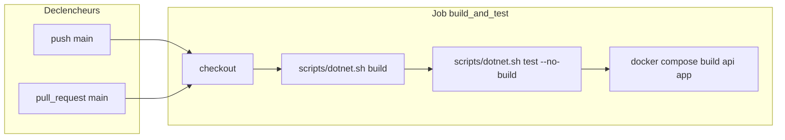

# Plan — GitHub CI (Docker-only)

## Objectif

Valider automatiquement le dépôt à chaque **push** et **pull request** sur `main`, sans installer le SDK .NET sur le runner GitHub. Toutes les commandes passent par Docker Compose, comme en local ([ADR 0005](../adr/0005-conteneurisation-docker.md)).

La CI doit garantir :

- la solution compile (`BattleShip.Models`, `BattleShip.API`, `BattleShip.App`, `BattleShip.Tests`) ;
- les tests xUnit passent (~92 tests, dont intégration API et gRPC) ;
- les images Docker `api` et `app` se construisent (proto gRPC, Blazor WASM, API ASP.NET).

**Choix retenu** : stratégie **Docker-only** (pas de `actions/setup-dotnet`), alignée avec le README et le workflow binôme.



---

## 1. Workflow GitHub Actions

Fichier implémenté : [`.github/workflows/ci.yml`](../../.github/workflows/ci.yml)

| Élément | Valeur |
|---------|--------|
| `name` | `CI` |
| `on` | `push` + `pull_request` sur branche `main` |
| `runs-on` | `ubuntu-latest` (amd64 — compatible `platform: linux/amd64` du compose) |
| Job | `build-and-test` (unique) |

### Étapes

| # | Step | Commande | Rôle |
|---|------|----------|------|
| 1 | Checkout | `actions/checkout@v4` | Récupère le code |
| 2 | Build | `./scripts/dotnet.sh build` | `docker compose --profile tools run --rm sdk dotnet build` |
| 3 | Test | `./scripts/dotnet.sh test --no-build` | Réutilise les binaires du step 2 |
| 4 | Docker build | `docker compose build api app` | Valide les Dockerfiles runtime |

Contenu actuel :

```yaml
name: CI

on:
  push:
    branches: [main]
  pull_request:
    branches: [main]

jobs:
  build-and-test:
    runs-on: ubuntu-latest
    steps:
      - uses: actions/checkout@v4

      - name: Build
        run: ./scripts/dotnet.sh build

      - name: Test
        run: ./scripts/dotnet.sh test --no-build

      - name: Docker build
        run: docker compose build api app
```

Pas de secrets, pas de déploiement, pas de publication d’images registry.

---

## 2. Pourquoi Docker-only (et pas `setup-dotnet`)

| Option | Avantage | Inconvénient |
|--------|----------|--------------|
| **Docker-only (retenu)** | Même environnement que le README / binôme ; SDK 10 via image officielle | Plus lent (~2–5 min) |
| `setup-dotnet` natif | CI plus rapide | Diverge de la contrainte projet « pas de SDK local » documentée |

Le script [`scripts/dotnet.sh`](../../scripts/dotnet.sh) encapsule déjà :

```sh
docker compose --profile tools run --rm sdk dotnet "$@"
```

La CI réutilise ce raccourci — une seule source de vérité pour build/test.

---

## 3. Prérequis et dépendances infra

| Fichier | Rôle dans la CI |
|---------|-----------------|
| [`docker-compose.yml`](../../docker-compose.yml) | Service `sdk` (profil `tools`), builds `api` / `app` ; `platform: linux/amd64` sur `sdk`, `api`, `app` |
| [`global.json`](../../global.json) | SDK 10.0.100 (image `mcr.microsoft.com/dotnet/sdk:10.0`) |
| [`.dockerignore`](../../.dockerignore) | Exclut `bin/`, `obj/`, `.git` — contexte Docker propre |
| [`BattleShip.slnx`](../../BattleShip.slnx) | Quatre projets buildés par `dotnet build` |

**Note Apple Silicon (dev local)** : le crash `protoc` gRPC en `linux_arm64` est contourné par `platform: linux/amd64` dans le compose. Les runners GitHub `ubuntu-latest` sont amd64 natifs — pas de problème côté CI.

---

## 4. Documentation livrée

| Fichier | Contenu ajouté |
|---------|----------------|
| [`README.md`](../../README.md) | Badge CI + section « GitHub Actions » (commandes, lien dépôt) |
| [`CONTEXTE-IA.md`](../../CONTEXTE-IA.md) | Mention CI Docker-only sur `main` |

Badge (dépôt réel) :

```markdown

```

---

## 5. Hors périmètre (volontaire)

- Pas de `docker compose up` + tests navigateur (lourd, flaky)
- Pas de cache NuGet Docker (`actions/cache` sur volume `nuget` — optimisation future)
- Pas de matrix multi-OS (cible Linux/Docker uniquement)
- Pas de `workflow_dispatch` manuel
- Pas de déploiement cloud (backlog cours « déploiement »)

---

## 6. Vérification

### Locale (reproduit la CI)

```bash
./scripts/dotnet.sh build
./scripts/dotnet.sh test --no-build
docker compose build api app
```

### Sur GitHub

1. Push ou PR vers `main`
2. Onglet **Actions** → workflow **CI**
3. Job `build-and-test` vert

Si `--no-build` échoue de façon intermittente en local (état iCloud / artefacts), relancer `build` puis `test --no-build`, ou `./scripts/dotnet.sh test` seul (rebuild implicite).

---

## 7. Fichiers impactés (résumé)

| Fichier | Action | Statut |
|---------|--------|--------|
| `.github/workflows/ci.yml` | Créer | Fait |
| `README.md` | Badge + section CI | Fait |
| `CONTEXTE-IA.md` | Mention CI | Fait |
| `docs/plans/github_ci_docker_b6794bee.plan.md` | Ce plan | Fait |

Pas de changement : code métier, tests, Dockerfiles (hors compose déjà patché pour amd64).
