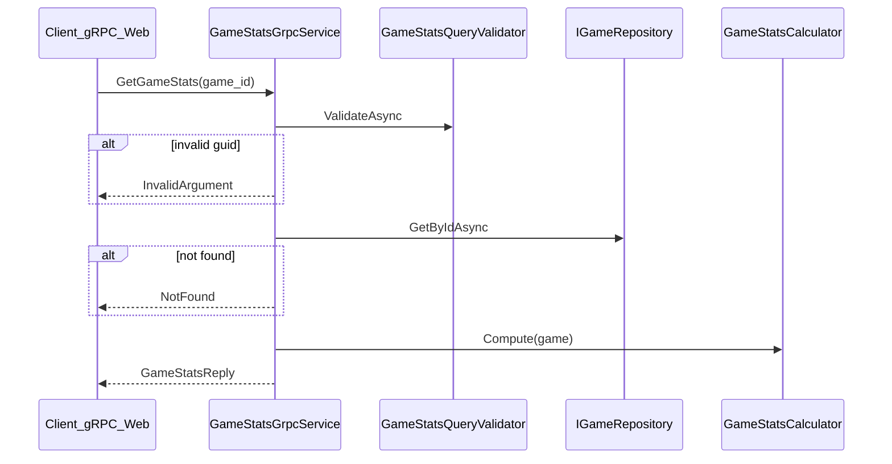

# Plan — statistiques de partie via gRPC (`GameStats`)

## Objectif

Exposer les stats d'une partie via **gRPC-Web** (hors REST, comme indiqué dans [`swagger.yaml`](battleship/swagger.yaml) et [`PROMPT-INIT.md`](battleship/PROMPT-INIT.md)), avec :

- succès sur `game_id` valide et partie existante ;
- `InvalidArgument` si `game_id` invalide ;
- `NotFound` si partie inconnue.

**Hors périmètre de cette passe** : client Blazor / affichage UI (passe front ultérieure). La démo cours sera documentée via **tests d'intégration** + commande **grpcurl** dans le README.



---

## 1. Contrat Protobuf

Créer [`Protos/battleship.proto`](battleship/Protos/battleship.proto) (spec [`PROMPT-INIT.md`](battleship/PROMPT-INIT.md) L199–219) :

```protobuf
service GameStats {
  rpc GetGameStats (GameStatsQuery) returns (GameStatsReply);
}

message GameStatsQuery { string game_id = 1; }

message GameStatsReply {
  string game_id = 1;
  int32 player_shots = 2;
  int32 computer_shots = 3;
  int32 player_hits = 4;
  int32 computer_hits = 5;
  string status = 6;
}
```

Référencer le proto dans [`BattleShip.API.csproj`](battleship/BattleShip.API/BattleShip.API.csproj) :

```xml
<PackageReference Include="Grpc.AspNetCore" />
<PackageReference Include="Grpc.AspNetCore.Web" />
<Protobuf Include="..\Protos\battleship.proto" GrpcServices="Server" />
```

(`Grpc.Tools` est transitif via Grpc.AspNetCore.)

---

## 2. Calcul des statistiques (stateless)

Créer [`BattleShip.API/Services/GameStatsCalculator.cs`](battleship/BattleShip.API/Services/GameStatsCalculator.cs) — lit un `Game` depuis le repository, **sans nouveau champ** sur `Game`.

### Règles PvE (`GameMode.VsComputer`)

| Champ proto | Source |
|-------------|--------|
| `player_shots` | cases ciblées sur `Player2Board` (`Miss` / `Hit` / `Sunk`) — doit aligner avec `Game.ShotCount` |
| `computer_shots` | cases ciblées sur `Player1Board` |
| `player_hits` | `Hit` + `Sunk` sur `Player2Board` |
| `computer_hits` | `Hit` + `Sunk` sur `Player1Board` |
| `status` | `game.Status.ToString()` |

Helpers privés sur `Board` via API publique existante (`GetCell`, `IsAlreadyTargeted`).

### Cas limites

| Situation | Comportement |
|-----------|--------------|
| `Waiting` / `PlacingFleet` | grilles partielles → compteurs à 0 sur board absent ; `status` renvoyé tel quel |
| `Player2Board` null (PvE avant `POST /fleet`) | `player_shots` / `player_hits` = 0 ; `computer_shots` = 0 |

### PvP (mapping minimal)

Même noms de champs, sémantique documentée dans l'ADR :

- `player_shots` → tirs sur `Player2Board` (joueur 1)
- `computer_shots` → tirs sur `Player1Board` (joueur 2)
- hits analogues

Pas de token dans le proto (spec cours) — stats globales de la partie.

---

## 3. Service gRPC + validation

### Validateur

[`BattleShip.API/Validation/GameStatsQueryValidator.cs`](battleship/BattleShip.API/Validation/GameStatsQueryValidator.cs) :

- `GameId` non vide ;
- parseable en `Guid` (sinon message clair pour `InvalidArgument`).

Note : le message proto généré expose `GameId` en PascalCase côté C#.

### Service

[`BattleShip.API/Grpc/GameStatsGrpcService.cs`](battleship/BattleShip.API/Grpc/GameStatsGrpcService.cs) :

```csharp
public sealed class GameStatsGrpcService(
    IValidator<GameStatsQuery> validator,
    IGameRepository repository,
    GameStatsCalculator calculator)
    : GameStats.GameStatsBase
{
    public override async Task<GameStatsReply> GetGameStats(
        GameStatsQuery request, ServerCallContext context)
    {
        // Validate → RpcException InvalidArgument
        // GetById → RpcException NotFound
        // return calculator.ToReply(game)
    }
}
```

Pattern identique à l'exemple cours [`CatalogueGrpcService.cs.txt`](csharp-school/Ressources%20Bataille%20Navale/Exemples/CatalogueGrpcService.cs.txt).

### DI + pipeline

Dans [`Program.cs`](battleship/BattleShip.API/Program.cs) :

```csharp
builder.Services.AddGrpc();
builder.Services.AddScoped<GameStatsCalculator>();
builder.Services.AddScoped<IValidator<GameStatsQuery>, GameStatsQueryValidator>();

// après Build :
app.UseGrpcWeb();
app.MapGrpcService<GameStatsGrpcService>().EnableGrpcWeb();
```

CORS existant (`http://localhost:8081`) reste suffisant pour gRPC-Web depuis le front futur.

---

## 4. Tests (`BattleShip.Tests`)

### Packages

Ajouter à [`BattleShip.Tests.csproj`](battleship/BattleShip.Tests/BattleShip.Tests.csproj) si besoin :

- `Grpc.Net.Client`
- `Google.Protobuf`

### Fichiers

| Fichier | Scénarios |
|---------|-----------|
| [`Validation/GameStatsQueryValidatorTests.cs`](battleship/BattleShip.Tests/Validation/GameStatsQueryValidatorTests.cs) | guid vide, guid invalide, guid valide |
| [`Domain/GameStatsCalculatorTests.cs`](battleship/BattleShip.Tests/Domain/GameStatsCalculatorTests.cs) | PvE après quelques tirs : shots/hits cohérents ; partie sans board adverse = 0 |
| [`Grpc/GameStatsGrpcServiceTests.cs`](battleship/BattleShip.Tests/Grpc/GameStatsGrpcServiceTests.cs) | via `WebApplicationFactory<Program>` + client gRPC sur `TestServer` : **200/success**, **NotFound**, **InvalidArgument** |

Setup intégration : réutiliser le helper fleet existant ([`FleetTestData`](battleship/BattleShip.Tests/TestHelpers/FleetTestData.cs)) → créer partie → placer flotte → quelques tirs → appeler `GetGameStats`.

---

## 5. Documentation

| Fichier | Contenu |
|---------|---------|
| [`docs/adr/0004-echange-grpc.md`](battleship/docs/adr/0004-echange-grpc.md) | **Nouveau** : pourquoi gRPC pour les stats (agrégat lecture seule, hors REST) ; mapping champs ; erreurs gRPC |
| [`docs/adr/0003-contrat-api.md`](battleship/docs/adr/0003-contrat-api.md) | Lien vers ADR 0004 |
| [`CONTEXTE-IA.md`](battleship/CONTEXTE-IA.md) | P0 gRPC `GameStats` → Fait (API) ; noter front à faire |
| [`README.md`](battleship/README.md) | Section « Stats gRPC » : endpoint, exemple **grpcurl** contre `localhost:8080` |
| [`swagger.yaml`](battleship/swagger.yaml) | Rappel que stats = gRPC uniquement (déjà présent, enrichir si besoin) |

Exemple doc grpcurl (HTTP, pas TLS) :

```bash
grpcurl -plaintext -d '{"game_id":"<uuid>"}' \
  localhost:8080 battleship.GameStats/GetGameStats
```

---

## 6. Vérification

```bash
./scripts/dotnet.sh test --filter "FullyQualifiedName~GameStats"
./scripts/dotnet.sh test
docker compose up --build -d api
# puis grpcurl avec un game_id issu de POST /api/games + POST /fleet
```

---

## 7. Passe front (faite — voir `front_grpc_gamestats_8bacbfaf.plan.md`)

Implémenté :

- packages `Grpc.Net.Client`, `Grpc.Net.Client.Web`, `Grpc.Tools` (Client) dans [`BattleShip.App.csproj`](battleship/BattleShip.App/BattleShip.App.csproj) ;
- `IGameStatsClient` + appel depuis [`GameSession`](battleship/BattleShip.App/Services/GameSession.cs) après chaque tir ;
- panneau dans [`StatusConsole.razor`](battleship/BattleShip.App/Shared/StatusConsole.razor) ou composant dédié.

---

## Fichiers impactés (résumé)

| Fichier | Action |
|---------|--------|
| `Protos/battleship.proto` | Créer |
| `BattleShip.API.csproj` | Packages gRPC + Protobuf |
| `GameStatsCalculator.cs` | Créer |
| `GameStatsGrpcService.cs` | Créer |
| `GameStatsQueryValidator.cs` | Créer |
| `Program.cs` | AddGrpc + MapGrpcService |
| `docs/adr/0004-echange-grpc.md` | Créer |
| Tests (3 fichiers) | Créer |
| README, CONTEXTE-IA, ADR 0003 | Mettre à jour |

Pas de changement : `BattleShip.Models` (zéro dépendance gRPC), contrat REST, `GameEngine`.
