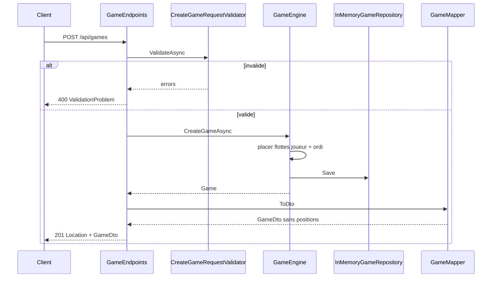
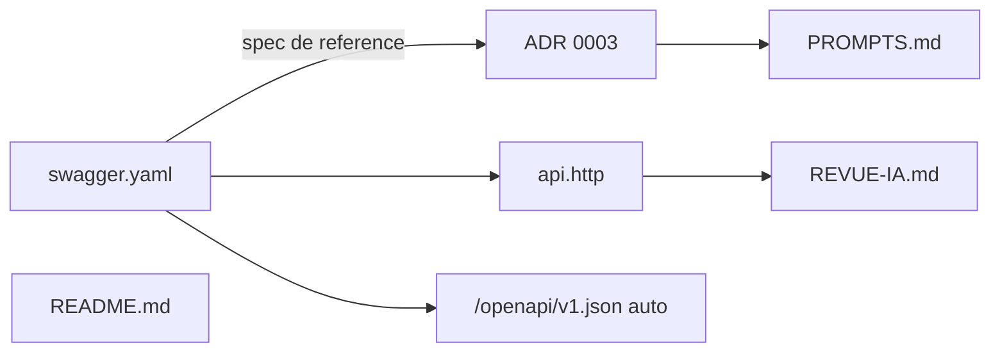

# Plan : POST /api/games

## Contexte

- **Contrat** : `[swagger.yaml](battleship/swagger.yaml)` lignes 30-58 — `POST /api/games`, body optionnel `CreateGameRequest`, réponses `201` + `GameDto` ou `400` ValidationProblem, header `Location`.
- **État actuel** : template uniquement (`[Program.cs](battleship/BattleShip.API/Program.cs)` avec `/weatherforecast`, `[Class1.cs](battleship/BattleShip.Models/Class1.cs)` vide).
- **Choix retenu** : placement aléatoire réel des deux flottes à la création (aligné swagger), pas un stub.

## Flux cible




## Périmètre de cette tâche

**Inclus** : une route, DTO/contrats nécessaires, domaine minimal pour créer une partie, moteur de placement, validateur, tests, `api.http`.

**Exclu** : autres routes (`GET /api/games/{id}`, shots, boards), gRPC, front Blazor, suppression complète du template weather (optionnelle mais recommandée pour éviter la confusion OpenAPI).

---

## 1. BattleShip.Models — domaine et contrats

Supprimer `[Class1.cs](battleship/BattleShip.Models/Class1.cs)`.

### Domaine (`BattleShip.Models/Domain/`)


| Fichier          | Rôle                                                                            |
| ---------------- | ------------------------------------------------------------------------------- |
| `GameStatus.cs`  | enum : Waiting, PlayerTurn, ComputerTurn, PlayerWon, ComputerWon                |
| `Difficulty.cs`  | enum : Easy, Normal, Hard                                                       |
| `CellState.cs`   | Empty, Ship, Hit, Sunk, Unknown (interne)                                       |
| `Ship.cs`        | Id, Name, Length, coordonnées (liste de cellules)                               |
| `Board.cs`       | Size, Cells[,], méthodes PlaceShip / IsValidPlacement                           |
| `GameOptions.cs` | BoardSize (défaut 10), Difficulty, flotte classique                             |
| `Game.cs`        | Id (Guid), Status, PlayerBoard, ComputerBoard, ShotCount, CreatedAt, Difficulty |


**Flotte par défaut** (PROMPT-INIT) : Porte-avions (5), Croiseur (4), Contre-torpilleur (3), Sous-marin (3), Torpilleur (2).

**Règles de placement** (Spec 1 cours) :

- horizontal ou vertical uniquement
- pas de chevauchement
- pas de débordement de grille
- aléatoire avec `Random` injectable (tests déterministes via seed)

### Contrats partagés (`BattleShip.Models/Contracts/`)

Alignés sur `[swagger.yaml](battleship/swagger.yaml)` schemas :

- `CreateGameRequest` — record avec `int? BoardSize`, `Difficulty? Difficulty` (tous optionnels)
- `GameDto` — Id, Status, CurrentTurn?, BoardSize, ShotCount, CreatedAt
- Enums JSON-serialisables (`GameStatus`, `Player` pour CurrentTurn)

**Visibilité** : `GameDto` ne contient **aucune** position de navire — conforme au contrat.

### Interfaces (`BattleShip.Models/Services/`)

```csharp
public interface IGameEngine
{
    Task<Game> CreateGameAsync(CreateGameRequest? request, CancellationToken ct = default);
}

public interface IGameRepository
{
    Task SaveAsync(Game game, CancellationToken ct = default);
    Task<Game?> GetByIdAsync(Guid id, CancellationToken ct = default);
}
```

---

## 2. BattleShip.API — implémentation

### Packages à ajouter (`[BattleShip.API.csproj](battleship/BattleShip.API/BattleShip.API.csproj)`)

- `FluentValidation`

### Services (`BattleShip.API/Services/`)


| Classe                   | Rôle                                                                                              |
| ------------------------ | ------------------------------------------------------------------------------------------------- |
| `InMemoryGameRepository` | Singleton, `ConcurrentDictionary<Guid, Game>`                                                     |
| `GameEngine`             | Scoped, placement aléatoire des deux flottes, status initial `PlayerTurn`, `CurrentTurn = Player` |
| `GameMapper`             | `Game` → `GameDto` (jamais de positions adverses)                                                 |


**Placement** : boucle avec retry limité (ex. 100 tentatives par navire) ; si échec après N essais → `InvalidOperationException` mappée en 500 (cas extrême, testable avec petite grille).

### Validation (`BattleShip.API/Validation/`)

`CreateGameRequestValidator` :

- `BoardSize` si présent : entre 5 et 20 (swagger)
- `Difficulty` si présent : valeur enum valide

Helper `ValidationExtensions.cs` :

```csharp
public static async Task<IResult?> ValidateAsync<T>(T input, IValidator<T> validator, CancellationToken ct)
    => /* ValidateAsync → TypedResults.ValidationProblem ou null */
```

### Endpoint (`BattleShip.API/Endpoints/GameEndpoints.cs`)

```csharp
group.MapPost("/", async Task<IResult> (
    CreateGameRequest? request,
    IGameEngine engine,
    IValidator<CreateGameRequest> validator,
    ILogger<...> logger,
    HttpContext ctx) =>
{
    request ??= new CreateGameRequest(null, null);
    var problem = await validator.ValidateAsync(request, validator, ct);
    if (problem is not null) return problem;

    var game = await engine.CreateGameAsync(request, ct);
    var dto = GameMapper.ToDto(game);
    return TypedResults.Created($"/api/games/{dto.Id}", dto);
});
```

Mapper le groupe sur `/api/games` dans `[Program.cs](battleship/BattleShip.API/Program.cs)`.

### DI (`[Program.cs](battleship/BattleShip.API/Program.cs)`)

```csharp
builder.Services.AddSingleton<IGameRepository, InMemoryGameRepository>();
builder.Services.AddScoped<IGameEngine, GameEngine>();
builder.Services.AddScoped<IValidator<CreateGameRequest>, CreateGameRequestValidator>();
builder.Services.AddSingleton<Random>(); // ou TimeProvider + Random factory
app.MapGameEndpoints();
```

Conserver CORS, OpenAPI, `public partial class Program`.

---

## 3. Tests (`BattleShip.Tests`)

Ajouter package `Microsoft.AspNetCore.Mvc.Testing` + `FluentValidation`.


| Fichier                                         | Cas                                                                                                                                                          |
| ----------------------------------------------- | ------------------------------------------------------------------------------------------------------------------------------------------------------------ |
| `Validation/CreateGameRequestValidatorTests.cs` | boardSize 4 → erreur ; boardSize 21 → erreur ; body vide → valide                                                                                            |
| `Domain/GameEnginePlacementTests.cs`            | flotte sans chevauchement ; reste dans la grille ; 2 grilles distinctes                                                                                      |
| `Api/CreateGameEndpointTests.cs`                | `WebApplicationFactory<Program>` : POST `{}` → 201 + GameDto ; POST `{boardSize:4}` → 400 ; header Location présent ; `shotCount == 0` ; status `PlayerTurn` |


Vérification via Docker :

```bash
./scripts/dotnet.sh test --filter "FullyQualifiedName~CreateGame"
```

---

## 4. Documentation (livrables cours + contrat)

La documentation n'est pas un fichier unique : chaque type a un rôle précis selon le cours.



### 4.1 Contrat technique (deja en place, a maintenir)

| Fichier | Role | Action |
|---------|------|--------|
| [`swagger.yaml`](battleship/swagger.yaml) | Source de verite du contrat REST | Verifier apres impl que les schemas `CreateGameRequest`, `GameDto`, codes 201/400 correspondent ; ajuster si ecart justifie |
| `/openapi/v1.json` | OpenAPI genere par l'API au runtime | Controle croise : `POST /api/games` doit apparaitre ; ne remplace pas `swagger.yaml` (cours diapo 35) |

### 4.2 ADR 0003 — Contrat API REST (a creer)

Fichier : [`docs/adr/0003-contrat-api.md`](battleship/docs/adr/0003-contrat-api.md) (format gabarit cours).

Contenu minimum pour cette route :

- **Contexte** : besoin de creer une partie, contrat dans `swagger.yaml`
- **Options** : routes REST vs RPC ; `GameDto` minimal vs renvoi des grilles a la creation
- **Decision** : `POST /api/games` retourne `GameDto` sans positions ; grilles via routes dediees plus tard
- **Consequences** : front doit enchainer `POST` puis `GET .../board/*` ; validation FluentValidation explicite
- **Verification** : `curl` 201/400, tests integration, lien vers commit
- **References** : `swagger.yaml`, `GameEndpoints.cs`

### 4.3 Essais manuels — `api.http` (a creer a la racine)

Remplacer le template [`BattleShip.API/BattleShip.API.http`](battleship/BattleShip.API/BattleShip.API.http) (weather) par un fichier racine aligne cours :

```http
@api = http://localhost:8080

### Creer une partie (defauts)
POST {{api}}/api/games

### Creer une partie (options)
POST {{api}}/api/games
Content-Type: application/json

{
  "boardSize": 10,
  "difficulty": "Normal"
}

### Creer une partie — validation echouee
POST {{api}}/api/games
Content-Type: application/json

{
  "boardSize": 4
}
```

Documenter dans le README que l'API doit tourner (`docker compose up api`).

### 4.4 README (a mettre a jour)

Section a ajouter dans [`README.md`](battleship/README.md) :

- Endpoint implemente : `POST /api/games`
- Exemple `curl` copiable
- Lien vers `swagger.yaml` et `api.http`
- Rappel : stats de partie = gRPC (pas encore implemente)

### 4.5 Traçabilite IA — `PROMPTS.md` (a creer)

Gabarit cours : une entree apres implementation.

Exemple de sujet : *« Implementation POST /api/games avec placement des flottes »*

Champs a remplir :

- Prompt utilise (implementation route + moteur placement)
- Decision : placement complet des le POST (vs stub)
- Verification : `./scripts/dotnet.sh test --filter CreateGame` + curl 201/400
- Preuve : hash du commit

### 4.6 Revue IA 1/3 — `REVUE-IA.md` (a creer)

Premiere revue du projet (roadmap etape 5) : **FluentValidation sur CreateGameRequest**.

| Champ | Contenu |
|-------|---------|
| Hypothese | Une entree invalide renvoie 400 ValidationProblem, pas 500 |
| Scenario | `POST {"boardSize":4}` |
| Erreur detectable | Validateur non appele ou bypass |
| Preuve | test `CreateGameEndpointTests` + sortie curl |

### 4.7 Ce qu'on ne documente PAS ici

- **Front** : pas de changement Blazor pour cette tache (etape 7)
- **gRPC** : ADR 0004 plus tard
- **CONTEXTE-IA.md** : etape 2 roadmap (vision globale binome), pas specifique a une route

### 4.8 Ordre de redaction recommande

1. Implementer code + tests
2. Verifier curl / OpenAPI
3. Rediger ADR 0003
4. Creer `api.http` + MAJ README
5. Completer PROMPTS.md et REVUE-IA.md avec preuves reelles (commit hash)

---

## 5. Vérification manuelle

```bash
docker compose up --build -d api
curl -i -X POST http://localhost:8080/api/games \
  -H "Content-Type: application/json" \
  -d '{"boardSize":10,"difficulty":"Normal"}'
# Attendu : HTTP/1.1 201, header Location, body GameDto JSON

curl -i -X POST http://localhost:8080/api/games \
  -H "Content-Type: application/json" \
  -d '{"boardSize":4}'
# Attendu : HTTP/1.1 400, application/problem+json
```

OpenAPI généré (`/openapi/v1.json`) doit lister `POST /api/games` après implémentation (grâce à `WithOpenApi()` ou métadonnées Minimal API).

---

## 6. Commit suggéré

```
feat(api): implement POST /api/games with fleet placement

Create game endpoint with FluentValidation, in-memory storage,
random fleet placement for both players, and GameDto response
without revealing ship positions.

Docs: ADR 0003, api.http, README, PROMPTS.md, REVUE-IA 1/3.
```

---

## 7. Risques et points d'attention

- **Corps vide** : swagger indique `requestBody required: false` — traiter `null`/body absent comme `{}` avec défauts (boardSize 10, Normal).
- **Enum JSON** : sérialiser `Difficulty` et `GameStatus` en PascalCase (défaut System.Text.Json) pour coller au swagger.
- **Prochaine route** : `GET /api/games/{id}` réutilisera `IGameRepository` + `GameMapper` déjà en place.

