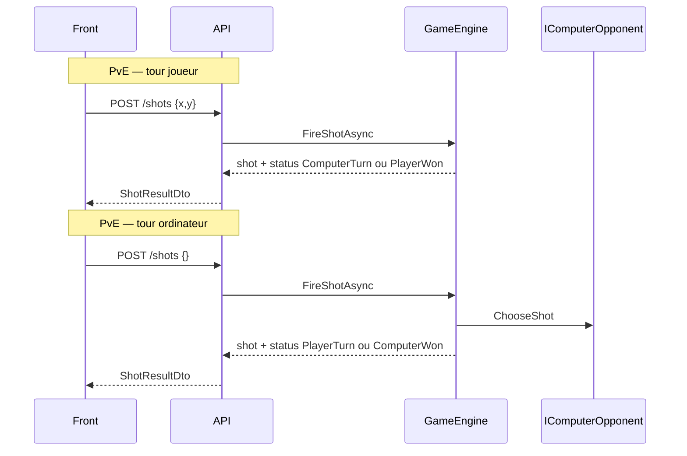

# Plan : POST /api/games/{id}/shots (un tir par requête)

## Décision de design

**Ancien contrat** ([`swagger.yaml`](battleship/swagger.yaml) L111-112, L432-459) : une requête résout `playerShot` + `computerShot?`.

**Nouveau contrat** : **1 requête = 1 tir**. Le front appelle deux fois en PvE si la partie continue.



| Mode | Tour actif (`status`) | Corps requis | Qui tire |
|------|----------------------|--------------|----------|
| PvE | `PlayerTurn` | `{x, y}` | Joueur (Player1) |
| PvE | `ComputerTurn` | `{}` (coords absentes) | Ordinateur via `IComputerOpponent` |
| PvP | `Player1Turn` / `Player2Turn` | `{x, y}` + `X-Player-Token` | Humain correspondant |

`ShotCount` : incrémenté **uniquement** sur tir humain valide (spec cours).

---

## 1. Contrat — breaking change

### [`BattleShip.Models/Contracts/ShotDtos.cs`](battleship/BattleShip.Models/Contracts/ShotDtos.cs)

```csharp
public record ShotRequest(int? X, int? Y);

public record ShotResultDto(
    ShotOutcomeDto Shot,
    PlayerSide Shooter,
    GameStatus Status);
```

Supprimer `PlayerShot` / `ComputerShot`.

### [`swagger.yaml`](battleship/swagger.yaml)

- `ShotRequest` : `x` et `y` **nullable** (requis seulement au tour humain)
- `ShotResultDto` : `shot`, `shooter`, `status` (supprimer `playerShot` / `computerShot`)
- Description route : un tir selon `status` courant ; `ComputerTurn` → body vide
- Ajouter paramètre header `PlayerToken` sur `POST .../shots` (PvP)

**Hors périmètre** : [`BattleShip.App`](battleship/BattleShip.App) reste sur l’ancien DTO jusqu’à une passe front dédiée (cassera temporairement la compilation App si on build toute la solution — acceptable si tests ciblent `BattleShip.Tests` + `BattleShip.API`).

---

## 2. Domaine — logique de tir

### [`CellState.cs`](battleship/BattleShip.Models/Domain/CellState.cs)

Ajouter `Miss`.

### [`Ship.cs`](battleship/BattleShip.Models/Domain/Ship.cs)

- `bool IsSunk`
- `void MarkSunk()` (interne)

### [`Board.cs`](battleship/BattleShip.Models/Domain/Board.cs)

| Méthode | Rôle |
|---------|------|
| `IsWithinBounds(x, y)` | bornes grille |
| `IsAlreadyTargeted(x, y)` | Miss / Hit / Sunk |
| `ResolveShot(x, y)` | Miss / Hit / Sunk ; lève si déjà ciblé |
| `AreAllShipsSunk()` | fin de partie |

### Simplifier [`TurnResolution.cs`](battleship/BattleShip.Models/Domain/TurnResolution.cs)

Remplacer le record « double tir » par un résultat unique :

```csharp
public sealed record ShotTurnResult(ShotResolution Shot, GameStatus Status);
```

`ITurnResolver` devient optionnel — la logique peut vivre directement dans `GameEngine.FireShotAsync` pour limiter la complexité (une seule méthode, branches PvE/PvP).

---

## 3. Services API

### [`IGameEngine`](battleship/BattleShip.Models/Services/IGameEngine.cs)

```csharp
Task<ShotTurnResult> FireShotAsync(
    Guid gameId,
    Participant? caller,      // null → résolu via token ou PvE implicite
    int? x, int? y,
    CancellationToken ct = default);
```

### [`RandomComputerOpponent.cs`](battleship/BattleShip.API/Services/RandomComputerOpponent.cs) (nouveau)

Implémente [`IComputerOpponent`](battleship/BattleShip.Models/Services/IComputerOpponent.cs) : case non ciblée aléatoire sur `Player1Board` (grille du humain en PvE).

### [`GameEngine.FireShotAsync`](battleship/BattleShip.API/Services/GameEngine.cs)

Logique centrale :

1. Charger partie → `GameNotFoundException`
2. Partie terminée / `Waiting` → `GameConflictException`
3. **Identifier le tireur attendu** depuis `game.Status` + `game.Mode` :
   - PvE `PlayerTurn` → `Participant.Player1`, coords obligatoires
   - PvE `ComputerTurn` → `Participant.Player2`, coords ignorées, `ChooseShot`
   - PvP → `caller` via `ParticipantResolver` + token ; doit correspondre à `ActiveParticipant`
4. Tir sur `game.GetOpponentBoard(shooter)`
5. `ShotCount++` si tireur humain (Player1 en PvE, Player1/Player2 en PvP)
6. **Transitions de statut** :
   - PvE joueur gagne → `PlayerWon`
   - PvE ordi gagne → `ComputerWon`
   - PvE sinon → alterner `PlayerTurn` ↔ `ComputerTurn`
   - PvP → `Player1Turn` ↔ `Player2Turn` ou `Player1Won` / `Player2Won`
7. `SaveAsync`, retourner `ShotTurnResult`

**409 sans mutation** : case déjà ciblée, mauvais tour, coords fournies pendant `ComputerTurn`, body vide pendant `PlayerTurn`.

**400** : coords hors grille (`ShotOutOfBoundsException`).

### [`ShotMapper.cs`](battleship/BattleShip.API/Services/ShotMapper.cs) (nouveau)

`ShotTurnResult` → `ShotResultDto` (map `Participant` → `PlayerSide` via `Game.MapToPlayerSide`).

### [`ShotRequestValidator.cs`](battleship/BattleShip.API/Validation/ShotRequestValidator.cs) (nouveau)

Validation **contextuelle** déléguée au moteur (validateur minimal : si `X` ou `Y` présents → `>= 0`). La règle « coords requises / interdites selon le tour » reste dans `GameEngine` → `409`/`400` explicites.

Alternative acceptable : validateur avec accès au statut via un `ShotRequestContext` — préférer la simplicité : validation coordonnées positives uniquement, règles métier dans le moteur.

---

## 4. Endpoint

### [`ShotEndpoints.cs`](battleship/BattleShip.API/Endpoints/ShotEndpoints.cs) (nouveau)

```csharp
POST /api/games/{id}/shots
Header optionnel: X-Player-Token
Body: ShotRequest (nullable)
→ 200 ShotResultDto
→ 400 / 404 / 409
```

- Lire header [`PlayerTokenHeaders.HeaderName`](battleship/BattleShip.Models/Contracts/PlayerTokenHeaders.cs)
- `ParticipantResolver.Resolve(game, token)` pour identifier l'appelant PvP
- Mapping exceptions → HTTP (réutiliser pattern [`GameEndpoints`](battleship/BattleShip.API/Endpoints/GameEndpoints.cs))

### [`Program.cs`](battleship/BattleShip.API/Program.cs)

```csharp
builder.Services.AddScoped<IComputerOpponent, RandomComputerOpponent>();
builder.Services.AddScoped<IValidator<ShotRequest>, ShotRequestValidator>();
app.MapShotEndpoints();
```

---

## 5. Tests (`BattleShip.Tests`)

| Fichier | Cas |
|---------|-----|
| `Domain/BoardShotTests.cs` | Miss, Hit, Sunk, refus case rejouée |
| `Domain/GameEngineShotTests.cs` | PvE : tir joueur → `ComputerTurn` ; tir ordi `{}` → `PlayerTurn` ; victoire ; 409 rejeu ; `ShotCount` inchangé sur 409 |
| `Validation/ShotRequestValidatorTests.cs` | coords négatives → erreur |
| `Api/FireShotEndpointTests.cs` | POST après create PvE : 200 joueur puis 200 ordi ; 404 ; 409 rejeu ; 400 hors grille ; PvP : token requis / mauvais tour |

Filtre :

```bash
./scripts/dotnet.sh test --filter "FullyQualifiedName~Shot"
```

---

## 6. Documentation

| Fichier | Action |
|---------|------|
| [`swagger.yaml`](battleship/swagger.yaml) | Nouveau contrat `ShotResultDto`, description alternance |
| [`api.http`](battleship/api.http) | Scénarios : tir joueur, tir ordi `{}`, rejeu 409 |
| [`docs/adr/0003-contrat-api.md`](battleship/docs/adr/0003-contrat-api.md) | Section shots, règle 1 tir/requête |
| [`docs/adr/0006-modes-de-jeu.md`](battleship/docs/adr/0006-modes-de-jeu.md) | Retirer mention « ComputerTurnResolver double tir » |

---

## 7. Vérification manuelle

```bash
./scripts/dotnet.sh test --filter "FullyQualifiedName~Shot"
docker compose up --build -d api

ID=$(curl -s -X POST http://localhost:8080/api/games -H "Content-Type: application/json" -d '{}' | jq -r .id)

# Tour joueur
curl -s -X POST http://localhost:8080/api/games/$ID/shots \
  -H "Content-Type: application/json" -d '{"x":4,"y":7}' | jq

# Tour ordinateur (si status = ComputerTurn)
curl -s -X POST http://localhost:8080/api/games/$ID/shots \
  -H "Content-Type: application/json" -d '{}' | jq

# Rejeu → 409
curl -i -X POST http://localhost:8080/api/games/$ID/shots \
  -H "Content-Type: application/json" -d '{"x":4,"y":7}'
```

---

## 8. Passe front ultérieure (hors ce plan)

Quand tu brancheras le front :

- [`GameSession.FireShotAsync`](battleship/BattleShip.App/Services/GameSession.cs) : après tir joueur, si `status == ComputerTurn` → 2e appel `POST /shots` avec `{}`
- [`ShotLog.razor`](battleship/BattleShip.App/Shared/ShotLog.razor) : une entrée par `ShotResultDto` (plus de paire player/computer)
- [`MockGameApiClient`](battleship/BattleShip.App/Services/MockGameApiClient.cs) : aligner sur le nouveau DTO

---

## Risques

- **Breaking change** sur `ShotResultDto` : le front actuel ne compile plus tant qu'il n'est pas migré
- **Body vide** : accepter `{}` et body absent pour `ComputerTurn` (configurer Minimal API en conséquence)
- **`ActiveParticipant`** : maintenir cohérence avec `Status` à chaque tir (Player1 sur `PlayerTurn`, Player2 sur `ComputerTurn`)

## Commit suggéré

```
feat(api): implement POST /shots with one shot per request

Resolve single shots per turn with PlayerTurn/ComputerTurn alternation in PvE,
token-based PvP support, and updated swagger contract.
```
