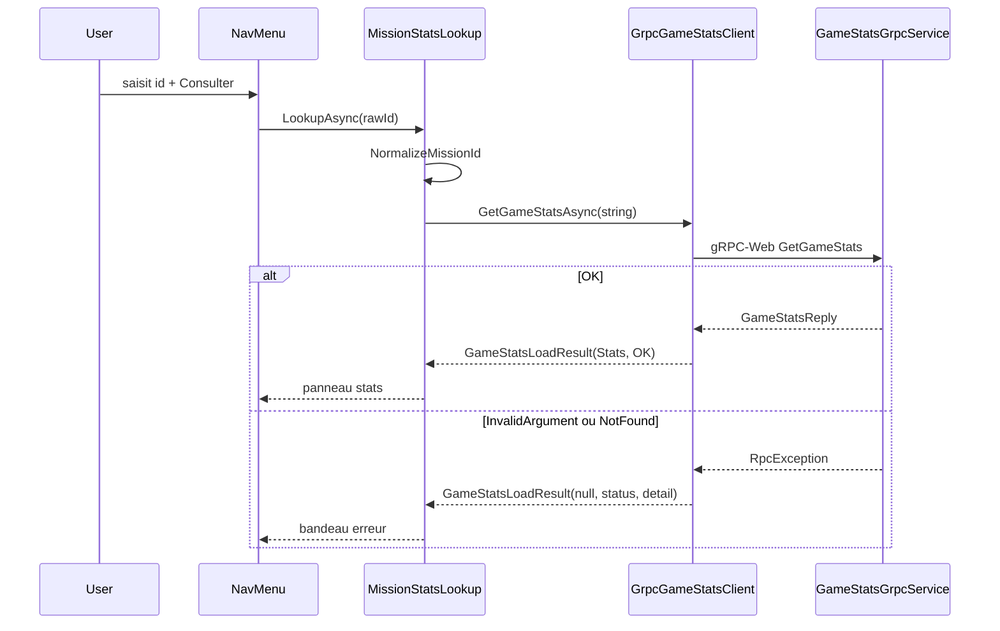

# Barre de recherche stats gRPC dans le header

## Objectif

Permettre de saisir un identifiant de partie (ou un extrait d'URL `/battle/...`) dans le header, appeler **uniquement** `GameStats.GetGameStats` via gRPC-Web, et afficher :

- **Succès** : statut + compteurs (tirs/touches)
- **Erreur** : `InvalidArgument` (texte illisible) ou `NotFound` (partie inconnue)

Pas de lien « Ouvrir la mission » (choix explicite). Le HUD en combat (`StatusConsole`) reste inchangé pour le refresh auto pendant une partie.

## Flux



## 1. Résultat gRPC explicite (client)

**Créer** [`BattleShip.App/Services/GameStatsLoadResult.cs`](battleship/BattleShip.App/Services/GameStatsLoadResult.cs) :

```csharp
public sealed record GameStatsLoadResult(
    GameStatsDto? Stats,
    string? StatusCode,   // "OK", "InvalidArgument", "NotFound", ...
    string? Detail);
```

**Modifier** [`IGameStatsClient.cs`](battleship/BattleShip.App/Services/IGameStatsClient.cs) :

- Remplacer `Task<GameStatsDto?> GetGameStatsAsync(Guid gameId, ...)` par `Task<GameStatsLoadResult> GetGameStatsAsync(string gameId, ...)`
- **Ne pas** parser le GUID côté client avant l'appel (sinon `InvalidArgument` disparaît)

**Modifier** [`GrpcGameStatsClient.cs`](battleship/BattleShip.App/Services/GrpcGameStatsClient.cs) :

- Envoyer `gameId` tel quel (après normalisation URL, voir §3)
- En succès : mapper vers `GameStatsDto` + `StatusCode = "OK"`
- En `RpcException` : retourner `Stats = null`, `StatusCode = ex.StatusCode.ToString()`, `Detail = ex.Status.Detail`
- Supprimer le `catch { return null }` silencieux

**Adapter** [`GameSession.RefreshStatsAsync`](battleship/BattleShip.App/Services/GameSession.cs) (~L224) :

```csharp
var result = await statsClient.GetGameStatsAsync(Game.Id.ToString(), ct);
Stats = result.Stats; // ignore les erreurs en refresh in-game (comportement actuel)
```

## 2. Service de lookup dédié (état header séparé du combat)

**Créer** [`BattleShip.App/Services/MissionStatsLookup.cs`](battleship/BattleShip.App/Services/MissionStatsLookup.cs) (scoped) :

| Propriété | Rôle |
|---|---|
| `Stats` | Dernier succès |
| `ErrorMessage` | Message utilisateur + code gRPC |
| `IsBusy` | Pendant l'appel |
| `IsAvailable` | `IGameStatsClient` enregistré (false en `UseMockApi`) |

| Méthode | Rôle |
|---|---|
| `LookupAsync(string rawId)` | Normalise, appelle gRPC, met à jour l'état, lève `Changed` |
| `Clear()` | Ferme le panneau (bouton ×) |

**Normalisation** (dans le service, pas de validation GUID) :

- Trim
- Si la saisie contient `/battle/`, extraire le segment après (gère collage d'URL complète)
- Retirer query string (`?...`)

**Messages utilisateur** :

| StatusCode | Message |
|---|---|
| `InvalidArgument` | `Identifiant illisible (InvalidArgument)` + détail serveur si présent |
| `NotFound` | `Partie inconnue (NotFound)` |
| autre | `Liaison stats interrompue` |

**Enregistrer** dans [`Program.cs`](battleship/BattleShip.App/Program.cs) : `builder.Services.AddScoped<MissionStatsLookup>();`

## 3. UI — header + panneau

### Header — [`NavMenu.razor`](battleship/BattleShip.App/Layout/NavMenu.razor)

Injecter `MissionStatsLookup` + `NavigationManager` (optionnel, non utilisé si pas de lien ouvrir).

Structure proposée :

```text
[ BATTLESHIP ]  [ input mission-id ] [ Consulter ]     [ SON ON/OFF ]
```

- Champ `<input>` avec `placeholder="Identifiant de partie"`
- Bouton `Consulter` (désactivé si `IsBusy` ou `!IsAvailable`)
- `@onkeydown` Enter → déclencher lookup
- Si `!IsAvailable` : masquer le champ ou afficher un hint discret « Stats gRPC — API réelle requise »

### Panneau résultat — **créer** [`BattleShip.App/Shared/MissionStatsPanel.razor`](battleship/BattleShip.App/Shared/MissionStatsPanel.razor) + `.razor.css`

- S'abonne à `MissionStatsLookup.Changed`
- **Erreur** : réutiliser le style `alert-banner` (comme [`AlertBanner.razor`](battleship/BattleShip.App/Shared/AlertBanner.razor))
- **Succès** : panneau compact `radar-panel` avec les 4 compteurs + statut (`Stats.Status`), même vocabulaire que `StatusConsole` (Tirs joueur/adversaire, Touches)
- Bouton `×` pour `Clear()`

### Layout — [`MainLayout.razor`](battleship/BattleShip.App/Layout/MainLayout.razor)

```razor
<NavMenu />
<MissionStatsPanel />
<main class="war-room__main">@Body</main>
```

Le panneau s'affiche sous le header, sur **toutes** les pages.

### Styles — [`NavMenu.razor.css`](battleship/BattleShip.App/Layout/NavMenu.razor.css)

- `.war-room__header` : passer en grille/flex à 3 zones (brand | search flex-grow | sfx)
- Input : fond sombre, bordure olive, police HUD — cohérent avec le thème existant
- Responsive (`max-width: 640px`) : input en dessous du brand si besoin

## 4. Documentation

**Mettre à jour** [`README.md`](battleship/README.md) section « Depuis le navigateur (Blazor) » :

1. Coller l'id d'une partie créée → stats affichées sous le header
2. Taper `test` → `InvalidArgument`
3. Coller un UUID au hasard → `NotFound`
4. DevTools → Network : requête gRPC-Web

**Mettre à jour** [`docs/adr/0004-echange-grpc.md`](battleship/docs/adr/0004-echange-grpc.md) :

- Remplacer « front consommera dans une passe ultérieure » par le flux header lookup
- Ajouter la démo navigateur des deux erreurs attendues

## 5. Hors périmètre (volontairement)

- Pas de modification API / proto / tests serveur (déjà couverts par [`GameStatsGrpcServiceTests.cs`](battleship/BattleShip.Tests/Grpc/GameStatsGrpcServiceTests.cs))
- Pas de tests Blazor (projet `BattleShip.Tests` ne référence pas `BattleShip.App`)
- Pas de lien « Ouvrir la mission »
- Pas de changement de route `/battle/{GameId:guid}`

## 6. Vérification manuelle

```bash
docker compose up --build
```

| Action | Résultat attendu |
|---|---|
| Créer partie PvE, copier id depuis URL, coller dans header | Panneau stats avec compteurs |
| Saisir `abc` | Bandeau `InvalidArgument` |
| Saisir UUID valide inconnu | Bandeau `NotFound` |
| Partie en cours + tir | `StatusConsole` continue d'afficher les stats (refresh in-game) |
| `UseMockApi: true` | Barre désactivée / absente |
